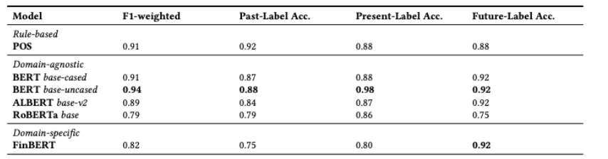

<h1 align="center">DigiCall: A Benchmark for Digital Strategy through Company Earning Call</h1>

Over the last decades, digital transformation has emerged as an
important phenomenon that enables growth opportunities to organizations.
Digital transformation reinvents the company, its vision
and strategy, organizational structure, processes, capabilities, culture,
and enables the development of new or enhanced products
and services delivered to customers more efficiently. Organizations,
by formalizing their digital strategy and leveraging their
digital resources, plan for their digital transformations. In order
to evaluate and understand the status quo of a company’s digital
transformation, the literature measures the status of its digital strategy. Therefore, understanding how successful a company is in
its digital strategy formulation and leveraging its digital resources,
starts with its accurate measurement and prediction of its digital
maturity levels. However, existing ways of assessing organizations’
digital strategy have low accuracy levels and this leads to inconsistent
results, and also does not provide resources (data) for future
research to improve. In order to overcome these limitations, we
release 3.691 earning call transcripts of S&P 500 companies for 2018
and 2019, and also annotated data by linguists. In order to measure
the digital strategy maturity of companies, we leverage the state-ofthe-
art NLP models on unstructured data (earning call transcripts),
and reach the state-of-the-art accuracy levels. Therefore, our work
is expected to provide an empirical baseline for companies and
researchers to measure the digital strategy of the firms.


<p align="center">
  
</p>


 **3.691 Earning Call transcripts of S&P 500 companies in 2018 and 2019:**


```
https://drive.google.com/drive/folders/1LR08Px8Ke4aB4RRBPMxWFolqzZ6Wq35W?usp=sharing
```
OR

```
!gdown --id 1LR08Px8Ke4aB4RRBPMxWFolqzZ6Wq35W
```

**For Annotated Data:**


```
https://github.com/hpataci/DigiCall/blob/main/data/annotated_earningcalls.csv
```

OR

```
!gdown --id 15UFD8alS79ri-gBnaWTKy0iXSES2mJMY
```
